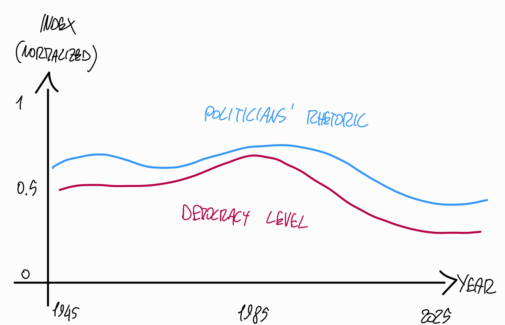

# Goal

Cross-compare:
- **Politicians' rhetoric**
  - complexity analysis
  - lexical analysis
  - hate speech detection
  - sentiment analysis 
  - etc
- **Democracy levels**
  - V-Dem dataset
  - Free speech
  - Separation of powers 
  - etc

Simplicity in visualization is a must: easy to read graphs are more usable -> reach bigger audience [soruce?]

Taking opposing colours can incite polarization, even though the effects are limited [source?]

## Politicians' Rhetoric  

2 Types:
- **To institutions (inside)**
  - Parliamentary speeches
  - Senate speeches
  - etc
- **To the people (outside)**
  - Official messages to the nation
  - Public speeches
  - Interviews
  - Social networks messages (video or textual)
    - eg Tweets
    - eg Videos on facebook (eg il diario di giorgia)

Social networks are at this point the main communication vehicle for politicians in the global north [source?], therefore it is of greater interest to gauge the political temperature via *outside communications*. Moreover, stenographic documents preceding a certain period are not 1:1 transcriptions of the actual speeches, but rather "speak the language of the parliament" [Cortelazzo,1985]  [Mohrhoff,1987]

Two other **advantages** of **outside communications**: 
1. A lot of documents
2. Easy automatization: take the social networks of politicians and track it

# Exam Scope Limiting

One country: Italy

# Text Corpus

Step 1: find text corpus:

- Italian politicians' public speeches
- Limited time scope

## What Corpus

1. Public speeches
   - official 
     - press conference
     - speeches to the nations
     - radio
     - tv
     - etc
   - unofficial
     - social network?
2. Parliament speeches
   - Italy: Camera dei Deputati
   - US: United States House of Representatives
   - FR: Assemblée nationale 
3. Presidential speeches
   - [Discorsi dei Presienti della Repubblica](https://archivio.quirinale.it/aspr/discorsi/search/result)

*At the 2005 UN World Summit, the speakers of parliament who came to United Nations Headquarters from every corner of the globe stated unequivocally that, within a democracy, parliament is the central institution through which the will of the people is expressed, laws are passed, and government is held to account* [...] *The fact that most parliaments have established their presence on the Web makes the legislative process and parliamentary proceedings more transparent and subject to public scrutiny.* [https://www.researchgate.net/profile/Cornelia-Ilie/publication/303459695_Parliamentary_Discourse/links/59d9dbdc458515a5bc2b1b17/Parliamentary-Discourse.pdf]

### Social Networks
*International survey data suggest online media audience members are largely passive consumers, while content creation is dominated by a small number of social users who post comments and write new content* [Tracking the future of news Reuters Institute digital news report 2013]

## Time Scope

## Geographical Scope

Only politicians of national relevance -> no majors or regional representative and similar.

## Corpus sources

### Accademia della crusca - Banca dati discorsi parlamentari
https://leader.accademiadellacrusca.org/

Filtered stenographic documents from 1948 to 2011

Focus on leadership, on some highly representative leaders.

Oss: until circa 1985 stenograph people changed things i.e., did not transcript word for word [Michele A. Cortelazzo, Dal parlato al (tra)scritto: i resoconti stenografici dei discorsi parlamentari, in Günter Holtus – Edgar Radtke (Hrsg.), Gesprochenes Italienisch in Geschichte und Gegenwart, Tübingen, Narr, 1985, pp. 86-118.]  [Aurelia Mohrhoff, Dalla lingua del Parlamento alla lingua del parlamentare, «Serie delle verifiche di professionalità dei consiglieri parlamentari», 1987, 1, p. 157.].

#### Elenco leader influenti

https://www.paroladileader.com/p/blog-page_24.html

### Documenti Stenografici Camera

Ordine del giorno + trascrizioni camera dei deputati

*Until May 1996 (excluded):* Only pdfs. Text is digitalized with OCR (optical character recognition).
After its all in HTML format.

#### Legislature 1048 - 2018

https://legislatureprecedenti.camera.it/

#### Legislatura 2022 - Attuale

https://www.camera.it/leg19/207?annomese=2022,10

#### Legislature Storiche 1848 - 1943

Lavori Parlamentari: https://storia.camera.it/lavori#nav 

Regno di Sardegna: legislature I -> VII
Regno d'Italia: legislature VIII -> XXX

### Documenti Stenografici Senato 

https://www.senato.it/legislature/1/lavori/assemblea/resoconti-elenco-cronologico?year=1953

