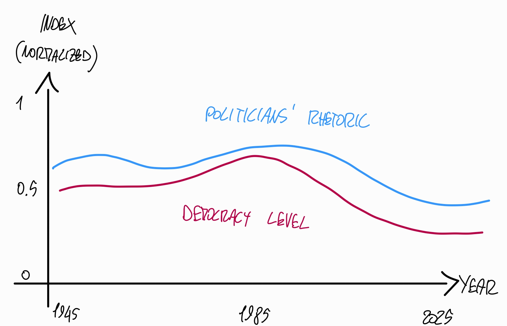
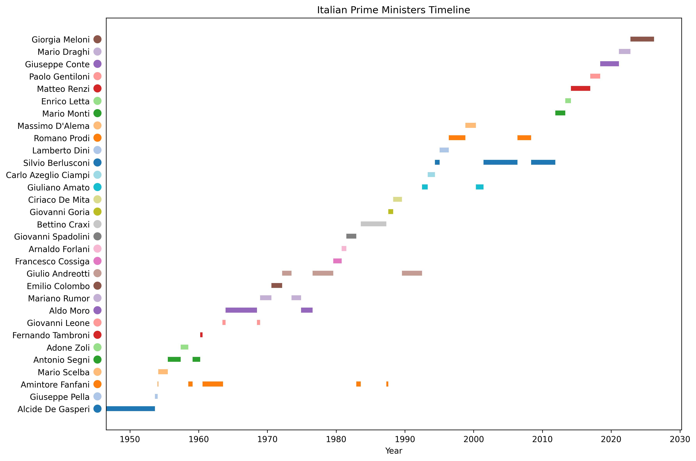
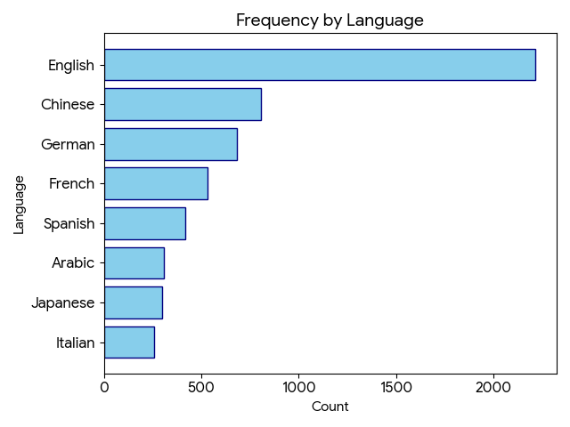

# Goal



Cross-compare:
- **Politicians' rhetoric**
  - complexity analysis
  - lexical analysis
  - hate speech detection
  - sentiment analysis 
  - etc
- **Democracy levels**
  - V-Dem dataset
  - Free speech
  - Separation of powers 
  - etc

Simplicity in visualization is a must: easy to read graphs are more usable -> reach bigger audience [source?]

Taking opposing colours can incite polarization, even though the effects are limited [source?]

# Politicians' Rhetoric  

2 Types:
- **To institutions (inside)**
  - Parliamentary speeches
  - Senate speeches
  - etc
- **To the people (outside)**
  - Official messages to the nation
  - Public speeches
  - Interviews
  - Social networks messages (video or textual)
    - eg Tweets
    - eg Videos on facebook (eg il diario di giorgia)

Social networks are at this point the main communication vehicle for politicians in the global north [source?], therefore it is of greater interest to gauge the political temperature via *outside communications*. Moreover, stenographic documents preceding a certain period are not 1:1 transcriptions of the actual speeches, but rather "speak the language of the parliament" [Cortelazzo,1985]  [Mohrhoff,1987]

Two other **advantages** of **outside communications**: 
1. A lot of documents
2. Easy automatization: take the social networks of politicians and track it
3. Less "political lingo" -> AIs are better trained on common language (greater amount of data) 


## Parliamentary versus Public Speeches

Parliamentary speeches are more technical and codified, while public speeches are addressed to the general public and contain stronger political and emotional messages.

Until circa 1985 stenograph people changed things i.e., did not transcript word for word [holtus,1985]  [mohrhoff,1987].


### Playing to the Gallery: Emotive Rhetoric in Parliaments
[osnabrugge,2021]

#### Summary

Emotive rhetoric is more pronounced in high-profile legislative debates, such as Prime Minister’s Questions

#### Content

These findings contribute to the study of legislative speech and political representation by suggesting that emotive rhetoric is used by legislators to appeal directly to voters.

#### Citations

### The determinants of the media coverage of politicians: The role of parliamentary activities
[yildirim,2026]

#### Summary

Speaking often in the parliament translates to higher media appearance

#### Content

#### Citations

### European parliaments under scrutiny: discourse strategies and interaction practices
[knezevic,2011]

#### Summary

Analyzes the "interpellation" (questioning) and "cut-and-thrust" of parliamentary debate as a unique genre that doesn't exist in public oratory.

#### Content

#### Citations


## AIs: Political Lingo vs Common Language

### Exploiting Vocabulary Frequency Imbalance in Language Model Pre-training
[chung,exploit,2025]

#### Summary

Show evidence that common words are learned better by AI agents

#### Content

Large language models are trained with tokenizers, and the resulting token distribution is highly imbalanced.

controlled study that scales the vocabulary of the language model from 24K to 196K while holding data, computation, and optimization unchanged: Above 24K, every common word is already tokenized as a single token, so enlarging vocabulary only deepens the relative token-frequency imbalance

larger vocabularies reduce cross-entropy loss almost exclusively by lowering uncertainty on the 2,500 most frequent words, even though *loss on the rare tail rises*.

I.E., *models are disproportionately optimized on* the part of language that appears most often, i.e., *common words and patterns* -> LLM training corpora are heavily skewed toward high‑frequency, everyday words and constructions

#### Citations

## Social Media and Public Opinions

### 2023, most used by europeans
For 71% of respondents, TV was one of their most used media to access news in the past days. TV is followed by online press and/or news platforms (42%). Radio and social media platforms (both 37%) are on shared third position followed by the written press (21%). Important to note that social media grew by 11 points since the previous year. Younger respondents are much more likely to use social media platform (59% of 15-24 year-olds vs 24% of 55+ year-olds) [eurobarometer,2023].

### 2024, most used by brits
49% reported using television to follow election news this summer. That compared against 26% who used social media, 24% who said they used news apps, 24% who used radio, 19% newspaper websites, 17% news sites not associated with newspapers and 16% word of mouth [maher,2024].

### Social Media as a Public Space for Politics: Cross-National Comparison of News Consumption and Participatory Behaviors in the United States and the United Kingdom
[saldana,2015]

#### Summary

Evidence of social media role in promoting citizens’ political engagement (US and UK)

#### Content

news consumption is positively related to political participation in both countries. In other words, the more people consume news and political information, the more they participate in politics. 

### Designing and validating the Social Media Political Participation Scale: An instrument to measure political participation on social media
[waeterloos,2021]

#### Summary

Evaluate political participation through social media

#### Content

Instrument SMPPS: Social Media Political Participation Scale measure who is politically engaged and why, as well as how digital technologies are embedded in diverse forms of political action. -> that captures the complexity of political partici- pation through social media platforms

#### Citations

In this regard, Bennett and Segerberg [3] introduced the concept of connective action. According to the authors, *taking public action has increasingly become an act of personal expression*. Hereby, a new logic of participation has emerged where ‘sharing’ is the starting point of political participation, enabled by various personal communication technologies such as social media [Bennet,2012] [bennet&seger,2012]

### Social media discourse and voting decisions influence: sentiment analysis in tweets during an electoral period
[rita,2022]

#### Summary

Tweets sentiment analysis is not a reliable election result predictor.

#### Content

this study searches for a conclusion of the actual persuasion capacity of social media in the electors when they need to decide whom to vote for as their next government -> to achieve it, it compares the sentiment that Social Media users demonstrated during an electoral period with the actual results of those election

Data were collected using R. The treatment and analysis were done with R and RapidMiner. Results show that tweets’ sentiment is not a reliable election results predictor. Additionally, results also show that it is impossible to state that social media impacts voting decisions. At least not from the polarity of the sentiment of opinions on social media

#### Citations

### Analyzing voter behavior on social media during the 2020 US presidential election campaign
[belcastro,2022]

#### Summary

Use social media data to poll public opinion on 2020 US presidential elections.

#### Content

2020 US presidential elections: determine in the weeks preceding the Election Day which candidate or party public opinion is most in favor of by jointly applying topic discovery, opinion mining, and emotion analysis techniques on social media data

Specifically, a real-time analysis was carried out during the 2020 US presidential election campaign using data gathered from Twitter, *correctly determining* Joe Biden’s lead over Donald Trump before the Election Day.

The obtained results confirm the great effectiveness of our approach, which outperformed the average of the latest opinion polls by *correctly identifying* the leading candidate before the Election Day *in 10 out of 11 swing states*. 

*One major drawback of this approach lies in different possible platform biases*, such as usage biases due to the distribution of users of a social media platform in terms of gender, age, culture and social status, as well as technical biases related to platform policies about data availability and restrictions imposed in some areas of the world

#### Citations

### A systematic review of worldwide causal and correlational evidence on digital media and democracy
[loren-spreen,2023]

#### Summary

Correlation between social media usage and decline in democracy

#### Content

Alongside the positive effects of digital media for democracy, there is clear evidence of seri- ous threats to democracy.

#### Citations

Figure 1a confirms that the search query mainly returned articles concerned with the most relevant associations between digital media and political outcomes. Most of the articles were published in the last 5 years, *highlighting the fast growth of interest in the link between digital media and democracy*. Articles span a range of disciplines, including political science, psychology, computational science and communication science.

Fig. 1d shows that many studies *focused* on political information online, and specifically *political information on social media*, in combination with political polarization and participation, 

### ! Politicians unleashed? Political communication on Twitter and in parliament in Western Europe
[silva,2021]

#### Summary

Sentiment on social network is a useful measure for politicians' opinions. 

#### Content

*MP: Member of Parliament*

Match tweets against parliamentary speeches to measure politicians sentiment on topic X. 

Using a *dataset containing tweets and parliamentary speeches* by members of parliament (MPs) in seven countries, we estimate politicians’ positions and intra-party dissent on European integration.

They find that MPs’ sentiment about Europe on Twitter is a valid measure of their party's position, while also uncovering intra-party disagreements. 

Most MPs amplify the partisan message, but MPs who participate less in parliamentary debate tend to have larger differences with their party on Twitter. Social media thus can free politicians from their party's grip.

Moreover, in the fewer instances where they do speak in parliament, we find that these dissidents express positions which are different to those they themselves express on Twitter, suggesting that perhaps even a *certain level of self-censoring is taking place* in the parliamentary arena.

Limitation: estimating a fine-grained measure of policy positioning at the individual MP level is substantially more difficult than doing so at the party level.

#### Citations

Social media allows politicians across Europe to directly communicate with the public. Such political communication stands in stark contrast to the regulated debates in parliaments, in which time constraints and procedural rules limit the ability of individual MPs to express views on all issues. Yet, despite the two different arenas, it is unclear how social media platforms actually change the way in which politicians communicate or interact with their voters, or what new incentives and opportunities they present. The lingering question is if, and how, the usage of social media by politicians is different from communication in parliaments

MPs could therefore have an incentive to choose Twitter to personalize their message and enhance their personal profile in cases where there is internal disagreement with the party line

### Do people learn about politics on social media? A meta-analysis of 76 studies 
[amsalem,2022]

#### Summary

Citizen get political information from social media but they are not more informed.

#### Content

Citizens turn increasingly to social media to get their political information. However, it is currently unclear whether using these platforms actually makes them more politically knowledgeable.

#### Citations

### ! Machine learning for predicting elections in Latin America based on social media engagement and polls
[brito,2022]

#### Summary

Accurately predict elections results with machine learning on social networks data

#### Content

Performance of Candidates on SM may be measured by engagement on official profiles.

We can use Machine Learning with SM data and polls to predict elections on a daily basis.

Elections prediction with SM data was similar to or more accurate than polls in Argentina, Brazil, Colombia, and Mexico.

#### Citations

the present paper proposes SoMEN, the Social Media framework for Election Nowcasting, a framework composed of a process and an ML model for nowcasting election results based on SM performance as features and with offline polls as labeled data. It also defines SoMEN-DC, an execution strategy for SoMEN that enables continuous prediction during the campaign (DC). The proposed metrics and framework were applied to some of the main recent presidential elections in Latin America: Argentina (2019), Brazil (2018), Colombia (2018), and Mexico (2018). More than 65,000 posts were collected from the SM profiles of candidates on Facebook, Twitter, and Instagram with data from 195 presidential polls.

the success of presidential campaigns is frequently attributed to being correlated with the SM performance of the candidates

The usual process of this approach consists of (i) Twitter data collection by pre-selected keywords during a specific interval; (ii) data cleaning, by removing tweets not addressing elections, together with duplicates or retweets; (iii) sentiment analysis using lexicon-based approaches or ML approaches; (iv) prediction based on volume/sentiment counting analysis using a linear formula; and (v) performance evaluation.
Current surveys have confirmed this low performance level: Brito et al. (Brito et al., 2021) reported that there was only a 55% success rate in the 64 studies that used the volume/sentiment approach.

### The Impact of Social Media Use for Elected Parliamentarians: Evidence from Politicians' Use of Twitter During the Last Two Swiss Legislatures
[reveilhac,2022]

#### Summary

Twitter-based activity moderately impacts politicians' political success, both in terms of political ranking and media coverage.

#### Content

#### Citations

Campaigning on social media has become a core feature of political communication.1 Parties and politicians rely heavily on these platforms to promote their views, interact with citizens and actors close to politics, and generate traditional media attention.
Step 1: find text corpus.


# Text Corpus

In order to execute any analysis at all I need to have a text corpora to work on.

1. Find which countries to compare
2. Find politicians representative of their time period
   1. how wide time period?
   2. prime minister / presidents?
   3. members of the opposition?
3. find public speeches of said politicians 

## Countries to Compare: FR, IT, US

The differences and similarities of these three countries make it so that it makes sense to compare them

- Executive Model:
  - USA: Full Presidential (President holds all power)
  - France: Semi-Presidential (power split between President and Prime Minister)
  - Italy: Parliamentary (Prime Minister holds the power but depends on Parliament)
- Party System: 
  - USA bipartisan system
  - France and Italy multi-party systems
- State System
  - France unitary state
  - Italy: unitary with strong regions
  - US: Federation
- Common background:
  - Allies in 2WW
  - Strong economical connection
  - Cultural influence between each other
- European context compared to American 

US, Italy and France history is highly entertwined, such as how the US helped them in the mediterranea strategy [brogi,2006] or how the US fought with the two countries communist parties [brogi,2011]


### Italy's democratic quality and the role of political parties: comparative empirical patterns
[Panzano,2025]

#### Summary

Italy is a political and social outlier 

#### Content

Italy represents both a positive/negative outlier or frontrunner/latecomer across different dimensions of democratic quality

most of its democratic defects can be explained by the high personalization and low institutionalization of its political parties


#### Citations

Italy is considered a thorny case for comparativists, as its unique political and party system features often make it stand out among liberal democracies.

### A Comparison of the French and Italian Parliaments 
[mezzabotta,2023]

#### Summary

France and Italy present notable differences between their parliamentary systems

#### Content

In France the government must constantly maintain the support of the National Assembly, making it more vulnerable to changes in the political climate and power shifts. On the other hand, in Italy, the government is accountable to both chambers, which requires it to have the support of a parliamentary majority in both chambers to govern. This gives the government more stability but also makes it harder for it to push through controversial policies

In Italy, the Senate has a more significant role, as it must also approve a motion of no confidence for the government to fall. 

In France, the two-round majority system tends to favour larger parties and makes it difficult for smaller parties to gain representation in the National Assembly. (more similar to US) -> not anymore now its not bipartisan [ledet,2026]

In Italy, the proportional system has led to a highly fragmented party system, with a large number of small parties gaining representation in the Chamber of Deputies and the Senate. This has resulted in unstable governments and frequent changes in coalitions.

#### Citations

### Confronting America: The Cold War between the United States and the Communists in France and Italy
[brogi,2011]

#### Summary

France and Italy's communist parties are superstrong and hate the US

#### Content

Throughout the Cold War, the United States encountered unexpected challenges from Italy and France, two countries with the strongest, and determinedly most anti-American, Communist Parties in Western Europe. 

Brogi shows that the resistance to Americanization was a critical test for the French and Italian communists' own legitimacy and existence. Their anti-Americanism was mostly dogmatic and driven by the Soviet Union, but it was also, at crucial times, subtle and ambivalent, nurturing fascination with the American culture of dissent. The staunchly anticommunist United States, Brogi argues, found a successful balance to fighting the communist threat in France and Italy by employing diplomacy and fostering instances of mild dissent in both countries. 

#### Citations

### "Competing Missions": France, Italy, and the Rise of American Hegemony in the Mediterranean
[brogi,2006]

#### Summary

How France, Italy and the US cooperated in their Mediterranean strategies.

#### Content

France and Italy regarded the Mediterranean as the arena where they could most naturally wage a struggle for power and status, but their ultimate goals and designs remained primarily focused on the continent: a greater role in the Mediterranean could be their key to attain a better mastery of European integration and, consequently, a greater role in the Western alliance. Stressing the persistence of intra-European rivalries during the most crucial phase of continental integration, this perspective helps clarify the American role as well. Washington developed a keen perception of French and Italian designs and ambitions, and was thus able to use them to stabilize the two countries’ domestic politics as well as NATO's balance of power.

## Other Corpora

### ParlaMint
https://github.com/clarin-eric/ParlaMint/
> Comparable parliamentary corpora for a number of countries and languages.

#### Attributes

> ~/datasets/ParlaMint-IT/ParlaMint-IT.TEI/Schema/ParlaMint.rnc

```py
## The identification element identifies a corpus element with an URI, and specifies its type and subtype.
idno =
  element idno {
    lang.att,
    attribute type { "URI" | "VIAF" },
    attribute subtype {
      "business"
      | "facebook"
      | "government"
      | "handle"
      | "instagram"
      | "ministry"
      | "parliament"
      | "personal"
      | "politicalParty"
      | "publicService"
      | "tiktok"
      | "twitter"
      | "wikimedia"
    }?,
    xsd:anyURI { pattern = "https?://.+" }
  }

## Legal values of the affiliation/@role attribute.
affiliationRole.val =
  "member"
  | "head"
  | "deputyHead"
  | 
    ## The following used only by FR:
    "minister"
  | "associateMember"
  | "nonAttachedMember"
  | "ministerDelegate"
  | 
    ## The following used only by CZ:
    "secretaryOfState"
  | "observer"
  | "verifier"
  | "vicePublicDefenderOfRights"
  | "publicDefenderOfRights"
  | "alternateOfDelegation"
  | "replacement"
  | 
    ## The following used only by BG:
    "representative"
  | "academician"
  | "candidateChairman"
  | "constitutionalJudge"
  | "deputyMinister"
  | "ombudsman"
  | "prosecutorGeneral"
  | "secretary"
  | "secretaryGeneral"

## Legal values of the kinesic/@type attribute.
kinesicType.val =
  "kinesic"
  | "applause"
  | "ringing"
  | "signal"
  | "playback"
  | "gesture"
  | "smiling"
  | "laughter"
  | "snapping"
  | "noise"

## Legal values of the incident/@type attribute.
incidentType.val =
  "action"
  | "incident"
  | "leaving"
  | "entering"
  | "break"
  | "pause"
  | "sound"
  | "editorial"

## Legal values of the vocal/@type attribute.
vocalType.val =
  "greeting"
  | "question"
  | "clarification"
  | "speaking"
  | "interruption"
  | "exclamat"
  | "laughter"
  | "shouting"
  | "murmuring"
  | "noise"
  | "signal"
```
#### Taxonomy
> structure, terminology and classification of data
> controlled vocabulary

**Topic**
> ~/datasets/ParlaMint-IT/ParlaMint-IT.TEI/ParlaMint-taxonomy-topic.xml

*Obs: most utterances are labeled as topic:other*

```xml
<?xml version="1.0" encoding="UTF-8"?>
<taxonomy xmlns="http://www.tei-c.org/ns/1.0" xml:id="ParlaMint-taxonomy-topic" xml:lang="mul">
   <desc xml:lang="en"><term>Topics</term>: Comparative Agendas Project <ref target="https://www.comparativeagendas.net/pages/master-codebook">CAP major topic labels</ref>
   </desc>
   <category xml:id="argic">
      <catDesc xml:lang="en"><term>Agriculture</term></catDesc>
   </category>
   <category xml:id="civil">
      <catDesc xml:lang="en"><term>Civil Rights</term></catDesc>
   </category>
   <category xml:id="cultu">
      <catDesc xml:lang="en"><term>Culture</term></catDesc>
   </category>
   <category xml:id="defen">
      <catDesc xml:lang="en"><term>Defense</term></catDesc>
   </category>
   <category xml:id="domes">
      ...
      ...
```


#### Adapted 
>Must be clearly defined beforehand

**Speeches**
- Remove:
  - Term
  - Session
- Add:
  - Event_Type:
    - `Interview`
    - `Press_Conference`
    - `Rally`
    - `Debate`
    - `Digital_Audio`
    - `Digital_Video`
    - etc
  - Venue_Channel
  - Source_URL
- Modify:
  - Speaker_Role:
    - host
    - moderator
    - etc
  - Speech_Type:
    - monologue
    - address
    - keep interruption


| Speech_ID | Date | Event_Type | Venue_Channel | Speaker_ID | Speaker_Role | Speech_Text | Incidents | Speech_Type | Source_URL |
| :--- | :--- | :--- | :--- | :--- | :--- | :--- | :--- | :--- | :--- |
| S_2026-03-30_001 | 2026-03-30 | Interview | BBC_News | P-SmithJ | host | Welcome back. Minister, you stated yesterday that taxes would not rise. Is that still a guarantee? | | Question | https://link... |
| S_2026-03-30_002 | 2026-03-30 | Interview | BBC_News | P-DavisJ | main_speaker | John, let me be crystal clear. We have absolutely no plans to— | | Answer | https://link... |
| S_2026-03-30_003 | 2026-03-30 | Interview | BBC_News | P-SmithJ | host | But you didn't answer the question, Minister. Is it a guarantee? | kinesic: [Points finger] | Interruption | https://link... |
| S_2026-03-31_001 | 2026-03-31 | Rally | Town_Square | P-MillerS | main_speaker | Thank you! Today, we stand together to build a better future for our region! | kinesic: [Wild applause] \| vocal: [Cheering] | Address | https://link... |

#### Example of transcript - seduta 392
**xml**
```xml
      <body>
         <div type="debateSection">
            <note type="speaker" xml:id="ParlaMint-IT_2022-01-03-LEG18-Senato-sed-392.note1">Presidenza del vice presidente TAVERNA</note>
            <note type="speaker" xml:id="ParlaMint-IT_2022-01-03-LEG18-Senato-sed-392.note2">PRESIDENTE</note>
            <u ana="#chair topic:other" who="#TavernaPaola" xml:id="ParlaMint-IT_2022-01-03-LEG18-Senato-sed-392.u1">
               <seg xml:id="ParlaMint-IT_2022-01-03-LEG18-Senato-sed-392.seg1">La seduta è aperta (ore 11). Si dia lettura del processo verbale. PUGLIA, segretario, dà lettura del processo verbale della seduta del 23 dicembre 2021. PRESIDENTE. Non essendovi osservazioni, il processo verbale è approvato.</seg>
            </u>
         </div>
         <div type="debateSection">
            <head xml:id="ParlaMint-IT_2022-01-03-LEG18-Senato-sed-392.head1">Comunicazioni della Presidenza</head>
            <note type="speaker" xml:id="ParlaMint-IT_2022-01-03-LEG18-Senato-sed-392.note3">PRESIDENTE</note>
            <u ana="#chair topic:other" who="#TavernaPaola" xml:id="ParlaMint-IT_2022-01-03-LEG18-Senato-sed-392.u2">
               <seg xml:id="ParlaMint-IT_2022-01-03-LEG18-Senato-sed-392.seg2">L'elenco dei senatori in congedo e assenti per incarico ricevuto dal Senato, nonché ulteriori comunicazioni all'Assemblea saranno pubblicati nell'allegato B al Resoconto della seduta odierna.</seg>
            </u>
         </div>
         <div type="debateSection">
            <head xml:id="ParlaMint-IT_2022-01-03-LEG18-Senato-sed-392.head2">Comunicazione, ai sensi dell'articolo 77, secondo comma, della Costituzione, della presentazione di disegno di legge di conversione di decreto-legge</head>
            <note type="time" xml:id="ParlaMint-IT_2022-01-03-LEG18-Senato-sed-392.note4">ore 11,10</note>
            <note type="speaker" xml:id="ParlaMint-IT_2022-01-03-LEG18-Senato-sed-392.note5">PRESIDENTE</note>
            <u ana="#chair topic:healt" who="#TavernaPaola" xml:id="ParlaMint-IT_2022-01-03-LEG18-Senato-sed-392.u3">
               <seg xml:id="ParlaMint-IT_2022-01-03-LEG18-Senato-sed-392.seg3">L'ordine del giorno reca: «Comunicazione, ai sensi dell'articolo 77, secondo comma, della Costituzione, della presentazione di disegno di legge di conversione di decreto-legge».</seg>
               <seg xml:id="ParlaMint-IT_2022-01-03-LEG18-Senato-sed-392.seg4">In data 30 dicembre 2021, è stato presentato il seguente disegno di legge: dal Presidente del Consiglio dei ministri e dal Ministro della salute: «Conversione in legge del decreto-legge 30 dicembre 2021, n. 229, recante misure urgenti per il contenimento della diffusione dell'epidemia da COVID-19 e disposizioni in materia di sorveglianza sanitaria» (2489).</seg>
            </u>
         </div>
         <div type="debateSection">
            <head xml:id="ParlaMint-IT_2022-01-03-LEG18-Senato-sed-392.head3">Disegni di legge, trasmissione dalla Camera dei deputati</head>
            <note type="speaker" xml:id="ParlaMint-IT_2022-01-03-LEG18-Senato-sed-392.note6">PRESIDENTE</note>
            <u ana="#chair topic:healt" who="#TavernaPaola" xml:id="ParlaMint-IT_2022-01-03-LEG18-Senato-sed-392.u4">
               <seg xml:id="ParlaMint-IT_2022-01-03-LEG18-Senato-sed-392.seg5">Comunico che in data 28 dicembre 2021, è stato trasmesso dal Ministro per i rapporti con il Parlamento il seguente disegno di legge di iniziativa del Presidente del Consiglio dei ministri e del Ministro della salute: «Conversione in legge del decreto-legge 24 dicembre 2021, n. 221, recante proroga dello stato di emergenza nazionale e ulteriori misure per il contenimento della diffusione dell'epidemia da COVID-19» (2488), già presentato alla Camera dei deputati il 24 dicembre 2021.</seg>
            </u>
         </div>
```

**txt**
```
ParlaMint-IT_2022-01-03-LEG18-Senato-sed-392.u1	La seduta è aperta (ore 11). Si dia lettura del processo verbale. PUGLIA, segretario, dà lettura del processo verbale della seduta del 23 dicembre 2021. PRESIDENTE. Non essendovi osservazioni, il processo verbale è approvato.
ParlaMint-IT_2022-01-03-LEG18-Senato-sed-392.u2	L'elenco dei senatori in congedo e assenti per incarico ricevuto dal Senato, nonché ulteriori comunicazioni all'Assemblea saranno pubblicati nell'allegato B al Resoconto della seduta odierna.
ParlaMint-IT_2022-01-03-LEG18-Senato-sed-392.u3	L'ordine del giorno reca: «Comunicazione, ai sensi dell'articolo 77, secondo comma, della Costituzione, della presentazione di disegno di legge di conversione di decreto-legge». In data 30 dicembre 2021, è stato presentato il seguente disegno di legge: dal Presidente del Consiglio dei ministri e dal Ministro della salute: «Conversione in legge del decreto-legge 30 dicembre 2021, n. 229, recante misure urgenti per il contenimento della diffusione dell'epidemia da COVID-19 e disposizioni in materia di sorveglianza sanitaria» (2489).
ParlaMint-IT_2022-01-03-LEG18-Senato-sed-392.u4	Comunico che in data 28 dicembre 2021, è stato trasmesso dal Ministro per i rapporti con il Parlamento il seguente disegno di legge di iniziativa del Presidente del Consiglio dei ministri e del Ministro della salute: «Conversione in legge del decreto-legge 24 dicembre 2021, n. 221, recante proroga dello stato di emergenza nazionale e ulteriori misure per il contenimento della diffusione dell'epidemia da COVID-19» (2488), già presentato alla Camera dei deputati il 24 dicembre 2021.
ParlaMint-IT_2022-01-03-LEG18-Senato-sed-392.u5	Domando di parlare.
ParlaMint-IT_2022-01-03-LEG18-Senato-sed-392.u6	Ne ha facoltà.
ParlaMint-IT_2022-01-03-LEG18-Senato-sed-392.u7	LANNUTTI (Misto-IdV). Signor Presidente, nei giorni scorsi «Report» ha documentato la truffa dei diamanti (per 1,3 miliardi di euro), venduti a malcapitati correntisti al triplo del prezzo di mercato. Si tratta di una frode sulla quale hanno indagato l'Antitrust e nel 2017 la procura di Milano, con riferimento alle società Intermarket diamond business (IDB), poi fallita, Diamond private investment di Roma (DPI) e a diverse banche, tra le quali MPS. I diamanti [...]
```

**metadata**

For each `<u>`
| Text_ID | ID | Title | Date | Body | Term | Session | Meeting | Sitting | Agenda | Subcorpus | Lang | Speaker_role | Speaker_MP | Speaker_minister | Speaker_party | Speaker_party_name | Party_status | Party_orientation | Speaker_ID | Speaker_name | Speaker_gender | Speaker_birth | Topic |
| :--- | :--- | :--- | :--- | :--- | :--- | :--- | :--- | :--- | :--- | :--- | :--- | :--- | :--- | :--- | :--- | :--- | :--- | :--- | :--- | :--- | :--- | :--- | :--- |
| ParlaMint-IT_2022-01-03-LEG18-Senato-sed-392 | ParlaMint-IT_2022-01-03-LEG18-Senato-sed-392.u1 | Resoconto della seduta del Senato della Repubblica italiana, Legislatura 18, seduta 392, giorno (2022-01-03) | 2022-01-03 | Senato della Repubblica | 18 | Legislatura | - | - | 392 | Seduta | - | COVID | italiano | Presidente | MP | notMinister | M5S.2 | MoVimento 5 Stelle | Coalition | Pigliatutto | TavernaPaola | Taverna, Paola | F | 1969 | Other |
| ParlaMint-IT_2022-01-03-LEG18-Senato-sed-392 | ParlaMint-IT_2022-01-03-LEG18-Senato-sed-392.u2 | Resoconto della seduta del Senato della Repubblica italiana, Legislatura 18, seduta 392, giorno (2022-01-03) | 2022-01-03 | Senato della Repubblica | 18 | Legislatura | - | - | 392 | Seduta | - | COVID | italiano | Presidente | MP | notMinister | M5S.2 | MoVimento 5 Stelle | Coalition | Pigliatutto | TavernaPaola | Taverna, Paola | F | 1969 | Other |
| ParlaMint-IT_2022-01-03-LEG18-Senato-sed-392 | ParlaMint-IT_2022-01-03-LEG18-Senato-sed-392.u3 | Resoconto della seduta del Senato della Repubblica italiana, Legislatura 18, seduta 392, giorno (2022-01-03) | 2022-01-03 | Senato della Repubblica | 18 | Legislatura | - | - | 392 | Seduta | - | COVID | italiano | Presidente | MP | notMinister | M5S.2 | MoVimento 5 Stelle | Coalition | Pigliatutto | TavernaPaola | Taverna, Paola | F | 1969 | Health |
| ParlaMint-IT_2022-01-03-LEG18-Senato-sed-392 | ParlaMint-IT_2022-01-03-LEG18-Senato-sed-392.u4 | Resoconto della seduta del Senato della Repubblica italiana, Legislatura 18, seduta 392, giorno (2022-01-03) | 2022-01-03 | Senato della Repubblica | 18 | Legislatura | - | - | 392 | Seduta | - | COVID | italiano | Presidente | MP | notMinister | M5S.2 | MoVimento 5 Stelle | Coalition | Pigliatutto | TavernaPaola | Taverna, Paola | F | 1969 | Health |
| ParlaMint-IT_2022-01-03-LEG18-Senato-sed-392 | ParlaMint-IT_2022-01-03-LEG18-Senato-sed-392.u5 | Resoconto della seduta del Senato della Repubblica italiana, Legislatura 18, seduta 392, giorno (2022-01-03) | 2022-01-03 | Senato della Repubblica | 18 | Legislatura | - | - | 392 | Seduta | - | COVID | italiano | Membro | MP | notMinister | Misto | Misto | - | - | LannuttiElio | Lannutti, Elio | M | 1948 | Other |
| ParlaMint-IT_2022-01-03-LEG18-Senato-sed-392 | ParlaMint-IT_2022-01-03-LEG18-Senato-sed-392.u6 | Resoconto della seduta del Senato della Repubblica italiana, Legislatura 18, seduta 392, giorno (2022-01-03) | 2022-01-03 | Senato della Repubblica | 18 | Legislatura | - | - | 392 | Seduta | - | COVID | italiano | Presidente | MP | notMinister | M5S.2 | MoVimento 5 Stelle | Coalition | Pigliatutto | TavernaPaola | Taverna, Paola | F | 1969 | Other |
| ParlaMint-IT_2022-01-03-LEG18-Senato-sed-392 | ParlaMint-IT_2022-01-03-LEG18-Senato-sed-392.u7 | Resoconto della seduta del Senato della Repubblica italiana, Legislatura 18, seduta 392, giorno (2022-01-03) | 2022-01-03 | Senato della Repubblica | 18 | Legislatura | - | - | 392 | Seduta | - | COVID | italiano | Membro | MP | notMinister | Misto | Misto | - | - | LannuttiElio | Lannutti, Elio | M | 1948 | Domestic Commerce |

#### Parties
| Party_ID | Party_Name | Abbreviation | Gov_Role | Orientation |
| :--- | :--- | :--- | :--- | :--- |
| ORG-NDP | National Democratic Party | NDP | Coalition | Centre-Left |
| ORG-CU | Conservative Union | CU | Opposition | Centre-Right |

#### Speakers
| Speaker_ID | First_Name | Last_Name | Gender | Status | Party_ID | Birth_Year |
| :--- | :--- | :--- | :--- | :--- | :--- | :--- |
| P-MillerS | Sarah | Miller | F | MP | ORG-NDP | 1975 |
| P-ChenL | Lin | Chen | M | MP | ORG-CU | 1982 |
| P-DavisJ | James | Davis | M | Minister | ORG-NDP | 1968 |

#### Speeches (transcripts)
| Speech_ID | Date | Term | Session | Speaker_ID | Speaker_Role | Speech_Text | Incidents | Speech_Type | Addressee_ID |
| :--- | :--- | :--- | :--- | :--- | :--- | :--- | :--- | :--- | :--- |
| S_2026-03-30_001 | 2026-03-30 | 9 | 42 | P-MillerS | chair | The session is now open. We will begin with standard questions. I give the floor to Representative Chen. | | Statement | |
| S_2026-03-30_002 | 2026-03-30 | 9 | 42 | P-ChenL | regular | Thank you, Madam Chair. My question is for the Minister of Energy. Why has the regional solar subsidy been delayed by three months? | incident: [Microphone feedback] | Question | P-DavisJ |
| S_2026-03-30_003 | 2026-03-30 | 9 | 42 | P-DavisJ | regular | I thank the representative for the question. The delay was strictly due to a logistical hold-up in the treasury, which was resolved yesterday. | vocal: [Groans] \| kinesic: [Applause from the right] | Answer | P-ChenL |


### Europarl
>plaintext with minimal tagging 

```
<CHAPTER ID=1>
Approvazione del processo verbale della seduta precedente
<SPEAKER ID=1 NAME="Presidente">
Il processo verbale della seduta di ieri è stato distribuito.
<P>
Vi sono osservazioni?

<SPEAKER ID=2 NAME="Speroni">
Signor Presidente, ieri, al termine della votazione sul bilancio, c'è stato un momento particolare in quanto le tre Istituzioni coinvolte erano rappresentate da persone di sesso femminile e il Presidente ha concluso dicendo che il millennio termina bene. Volevo solo osservare, come di recente ha rilevato anche l'autorevole osservatorio di Greenwich, che il millennio terminerà il 31 dicembre dell'anno 2000.

<SPEAKER ID=3 NAME="Presidente">
Onorevole Speroni, sono consapevole del fatto che, da un punto di vista razionale e cartesiano, lei ha assolutamente ragione. Scientificamente lei ha ragione. Tuttavia, dal punto di vista delle credenze popolari, il millennio si conclude tra 14 giorni. Pertanto, la sua osservazione sarà messa a verbale, ma ritengo che ognuno celebrerà l' evento il 31 dicembre di quest' anno e forse per due volte.
<P>
```

### ItaParlCorpus
[Cova,2025]
>comprehensive, annotated, and machine-readable database of Italy’s parliamentary speeches spanning from 1948 to 2022. 

| date | doc_id | row_id | legislature | speaker | pageid_wiki | party_name | party_family | party_id_parlgov | party_id_itaparl | chair | cabinet | text | year |
| :--- | :--- | :--- | :--- | :--- | :--- | :--- | :--- | :--- | :--- | :--- | :--- | :--- | :--- |
| 2006-04-28 | 20060428 | 20060428 | 15 | PRESIDENTE | | Chair | PRESIDENTE | | 11 | TRUE | FALSE | , venerdì 28 aprile 2006, PRESIDENZA DEL PRESIDENTE, PROVVISORIO FABIO MUSSI, La seduta comincia alle 10,05., Sull'attentato terroristico di Nassiriya., PRESIDENTE, . (Si leva in piedi, e con lui l'intera Assemblea). Nicola Ciardelli, capitano dell'esercito, 34 anni: caduto; Franco Lattanzio, maresciallo capo dei carabinieri, 38 anni: caduto; Carlo De Trizio maresciallo capo dei carabinieri, 38 anni: caduto; Enrico Frassanito, maresciallo aiutante dei carabinieri, 41 anni: [...]| 2006 |

### IMPAQTS
[cominetti,2024]
>Multimodal corpus of around 2.65 million tokens including 1,500 speeches uttered by 150 prominent politicians spanning from 1946 to 2023

>For each speaker, the corpus contains 4 parliamentary speeches, 2 rallies, 1 party assembly, and 3 statements (in person or broadcasted)

Could be useful to integrate but the site doesnt work at the moment. https://impaqts.it/ 

#### Paper's Extracts


### Parola di Leader

#### Vocabs Corpus

For each vocab:
- total # occurrences
- part of speech
- lemma
- count # occurences for:
  - each politicians
  - major party
  - opposition

- Imprinting: 
  - s_m: singolare maschile
  - indic_pres_s_3: indicativo presente singolare 3a persona

|Forma grafica|Occorrenze totali|CAT|CAT_AC|CAT_SEM|Imprinting|Lemma|Informazioni aggiuntive|COMUNICAZIONI|LEGGI|MOZIONI|ALMIRANTE|AMATO|ANDREOTTI|BERLINGUER|BERLUSCONI|BERSANI|BERTINOTTI|BINDI|BONINO|BOSSI|CASINI|COSSIGA|CRAXI|DALEMA|DEGASPERI|DEMITA|DIPIETRO|FANFANI|FINI|LAMALFA|MORO|NENNI|OCCHETTO|PANNELLA|PRODI|SARAGAT|SPADOLINI|TOGLIATTI|VELTRONI|VENDOLA|L01|L02|L03|L04|L05|L06|L07|L08|L09|L10|L11|L12|L13|L14|L15|L16|APPOGGIO|ASTENSIONE|MAGGIORANZA|OPPOSIZIONE|
|--|--|--|--|--|--|--|--|--|--|--|--|--|--|--|--|--|--|--|--|--|--|--|--|--|--|--|--|--|--|--|--|--|--|--|--|--|--|--|--|--|--|--|--|--|--|--|--|--|--|--|--|--|--|--|--|--|--|--|--|--|
|di|220319|J|N+PREP|||di|N/VB3;PREP/VB1|109204|53597|57518|36180|3748|13557|4672|5606|1526|3241|3271|11422|2608|3554|4191|7778|7507|3868|3878|2190|5611|6042|10902|10998|9295|3929|21782|3875|6332|3948|15135|2470|1203|21302|12244|19587|18044|14722|13054|22128|20808|15405|12430|10001|5541|16854|7923|4122|6154|4498|3642|85464|126715
|che|170572|J|A+CONG+N+PRON|||che||80768|46604|43200|28857|3318|8521|3366|3586|1456|2207|2886|10958|2420|3088|2146|4834|5537|3383|2496|2520|3023|5834|9345|6703|6848|2822|19027|2645|5185|2346|12798|1710|707|19028|9513|14441|12809|11529|9022|17913|15097|11551|8958|8111|4325|13288|5818|3186|5983|3707|2577|57919|106369|
|e|147524|CONG|CONG||inv|e|VB1|75297|34575|37652|24156|2437|7669|4285|4692|1178|1950|2276|6523|1910|2374|3142|5541|4732|3096|2282|1805|3800|3091|6653|7640|6646|2893|14760|3235|3189|2453|10914|1548|654|14973|8220|13126|11917|9824|8475|13922|13904|10360|7783|7126|3786|11149|5310|2596|5053|2833|2617|56953|85121|
|il|103842|DET|DET||s_m|il|VB1|51808|25484|26550|17495|1627|5375|1897|2951|720|1505|1760|5306|1810|1887|1841|2992|3371|1943|1761|1248|2880|3355|5365|4615|5073|1655|9996|2134|3311|1708|6726|1121|414|11063|5841|9044|8441|6373|5709|9654|9508|6989|5649|4775|2848|8388|4039|2105|3416|2274|1631|38603|61334|
|la|102973|J|DET+N+PRON|||la|VB1|51214|26215|25544|15367|1601|5349|2054|2754|700|1697|1689|5041|2098|1788|1809|3070|3277|2352|2000|1259|2625|2791|5308|5020|5403|1917|9655|1861|3596|1569|7753|1117|453|12500|6422|9314|7879|6062|5276|9752|8798|6816|5356|4545|2877|8105|3917|1970|3384|2088|1862|38685|60338|
|non|89434|J|A+AVV||inv|non||41603|25081|22750|18205|1383|4442|1432|1565|911|1231|1564|6376|1159|1819|965|2033|2543|1488|1594|1355|1560|2817|4625|3030|3860|1481|10881|920|2281|1055|5838|690|331|10024|4831|6853|6651|6649|5218|10223|8214|5882|4660|4226|2195|6121|2920|1448|3319|1964|1279|26648|59543|
|in|83769|J|A+PREP||inv|in||39796|22050|21923|15759|1471|4875|1514|1782|619|1171|1421|5053|1118|1528|1432|2438|2646|1451|1294|957|2012|2746|3865|4221|3290|1251|8097|1490|2376|1466|5150|955|321|8448|4461|7185|7167|5815|4844|8515|7674|5649|4558|3669|2061|6305|3024|1822|2572|1673|1183|30971|49942|

#### Silvio Berlusconi Corpus

Each line has metadata for one file which likely contains the speech itself.

Most of this won't concern my corpus, except date.

| Leader | Ruolo | Posizionamento politico | N. Legislatura | N. Seduta | Data della seduta | Atti parl. pag. | Tipo di intervento | Argomento | Governo in carica | File-id |
| :--- | :--- | :--- | :--- | :--- | :--- | :--- | :--- | :--- | :--- | :--- |
| Silvio BERLUSCONI | Presidente del Consiglio | Maggioranza | 12 | 5 | 16/05/1994 | 98 | Comunicazioni del governo | | I Berlusconi | BERLUSCONIXII5 |
| Silvio BERLUSCONI | Presidente del Consiglio | Maggioranza | 12 | 7 | 20/05/1994 | 287 | Comunicazioni del governo | | I Berlusconi | BERLUSCONIXII7 |
| Silvio BERLUSCONI | Deputato | Opposizione | 12 | 47 | 02/08/1994 | 2369 | Mozioni, interpellanze e interrogazioni | Interessi che si concentrano nella persona del Presidente del Consiglio dei ministri e sui rapporti tra potere esecutivo e potere giudiziario | Dini | BERLUSCONIXII47 |
| Silvio BERLUSCONI | Presidente del Consiglio | Maggioranza | 12 | 119 | 21/12/1994 | 7304 | Comunicazioni del governo | | I Berlusconi | BERLUSCONIXII119 |
| Silvio BERLUSCONI | Deputato | Opposizione | 12 | 126 | 24/01/1995 | 7608 | Comunicazioni del governo | | Dini | BERLUSCONIXII126 |
| Silvio BERLUSCONI | Deputato | Opposizione | 12 | 157 | 16/03/1995 | 9320 | Attività legislativa | Misure urgenti per il risanamento della finanza pubblica | Dini | BERLUSCONIXII157 |
| Silvio BERLUSCONI | Deputato | Opposizione | 12 | 230 | 02/08/1995 | 14388 | Attività legislativa | Revisione della parte seconda della Costituzione | Dini | BERLUSCONIXII230 |
| Silvio BERLUSCONI | Deputato | Opposizione | 12 | 268 | 24/10/1995 | 16443 | Mozioni, interpellanze e interrogazioni | Sfiducia al governo | Dini | BERLUSCONIXII268 |
| Silvio BERLUSCONI | Deputato | Opposizione | 12 | 310 | 10/01/1996 | 19392 | Comunicazioni del governo | | Dini | BERLUSCONIXII310 |
| Silvio BERLUSCONI | Deputato | Opposizione | 13 | 5 | 30/05/1996 | 301 | Comunicazioni del governo | | I Prodi | BERLUSCONIXIII5 |
| Silvio BERLUSCONI | Deputato | Opposizione | 13 | 34 | 17/07/1996 | 1709 | Mozioni, interpellanze e interrogazioni | Discussione di mozioni in tema di riforme istituzionali | I Prodi | BERLUSCONIXIII34 |
| Silvio BERLUSCONI | Deputato | Opposizione | 13 | 75 | 16/10/1996 | 4334 | Mozioni, interpellanze e interrogazioni | Svolgimento di interpellanze e interrogazioni sulla tutela della riservatezza dei cittadini e sulla disciplina dell'uso degli strumenti intrusivi | I Prodi | BERLUSCONIXIII75 |
| Silvio BERLUSCONI | Deputato | Opposizione | 13 | 94 | 11/11/1996 | 2372 | Attività legislativa | Misure di razzionalizzazione della finanza pubblica | I Prodi | BERLUSCONIXIII94 |


## My Corpus: Italy

1. Public speeches
   - official 
     - press conference
     - speeches to the nations
     - radio
     - tv
     - etc
   - unofficial
     - social network?
2. Parliament speeches
   - Italy: Camera dei Deputati
   - US: United States House of Representatives
   - FR: Assemblée nationale  
3. Presidential speeches
   - [Discorsi dei Presienti della Repubblica](https://archivio.quirinale.it/aspr/discorsi/search/result)

**Goal:** 
1. Find a list of influential politicians over the time span
2. Gather corpus i.e., public speeches (speeches, interviews, videos, open letters, etc)

### Table Structure

- **df:italian_governments**
  - *col:government*
    - `degasperi2` : "De Gasperi II"
    - `spadolini1` : "Spadolini I"
    - `forlani` : "Forlani" 
  - *col:primeMinister*
    - `degasperi` : `prime_ministers.id==degasperi` 
  - *col:dateStart*
    - ISO 8601 (YYYY-MM-DD)
  - *col:dateEnd* 
    - ISO 8601 (YYYY-MM-DD)
  - *col:legislature*
    - `1` : "I Legislatura"
    - `15` : "XV Legislatura"
  - *col:pm_party*
  - *col:gov_leaning*
    - the political leaning of the specific government
- **df:prime_ministers**
  - *col:pm_ID*
    - `degasperi`
    - `draghi`
    - `meloni`
  - *col:pm_name*
    - `Alcide`
    - `Mario`
    - `Giorgia`
  - *col:pm_familyName*
    - `De Gasperi`
    - `Draghi`
    - `Meloni`
  - *col:pm_birthDate*
  - *col:pm_deathDate*
  - 

### Taxonomy

- political leaning:
  - `mixed`
    - e.g., [CLN](https://en.wikipedia.org/wiki/National_Liberation_Committee)
    - e.g., [Pentapartito](https://en.wikipedia.org/wiki/Pentapartito)
  - Far-Right: `RR`
  - Far-Left: `LL`
  - Right: `right`
  - Left: `left`
  - Center: `center`
  - Center-Right: `centerRight`
  - Center-Left: `centerLeft` 
  - 
### Democrazia Cristiana
 
Center? Center left? Center right? The DC party was famously characterized by the "Correnti" (factions) phenomenon, meaning different political groups, thus leanings, inside the party.  For example, "Vespisti" is a conservative right leaning faction, while the "Gronchiani" faction is more left leaning.

### Prime Ministers

An obvious way to gather influential political figures is by taking the prime ministers.

Presidents of the Italian Republic, on the other hand, represents national unity and guarantees that Italian politics comply with the Constitution but its role is more ceremonial.

De Gasperi: 10 dicembre 1945 – 13 giugno 1946 "Presidente del Consiglio dei ministri del Regno d'Italia" since it was not yet the Italian Republic.

[https://legislature.camera.it/organiparlamentariSM/241/4405/5342/documentotesto.ASP?cost=3] -> not complete

[Wikipedia](https://it.wikipedia.org/wiki/Presidenti_del_Consiglio_dei_ministri_della_Repubblica_Italiana) 


### Accademia della crusca - Banca dati discorsi parlamentari
https://leader.accademiadellacrusca.org/

Filtered stenographic documents from 1948 to 2011

Focus on leadership, on some highly representative leaders.

Oss: until circa 1985 stenograph people changed things i.e., did not transcript word for word [holtus,1985]  [mohrhoff,1987].

#### Elenco leader influenti

https://www.paroladileader.com/p/blog-page_24.html

A list of Italian influential politicians from 1945 to Monti

Governo 
- Giuliano Amato
  - 12 luglio 1983 – 14 aprile 1994

Opposizione
- Giorgio Almirante: 	8 maggio 1948 – 22 maggio 1988 (Camera dei Deputati)

GIORGIO ALMIRANTE 

GIULIANO AMATO

GIULIO ANDREOTTI

ENRICO BERLINGUER
	
SILVIO BERLUSCONI
	
PIER LUIGI BERSANI

FAUSTO BERTINOTTI
	
ROSY BINDI
	
EMMA BONINO

UMBERTO BOSSI
	
PIER FERDINANDO CASINI
	
FRANCESCO COSSIGA

BETTINO CRAXI
	
MASSIMO D'ALEMA
	
ALCIDE DE GASPERI

CIRIACO DE MITA
	
ANTONIO DI PIETRO
	
AMINTORE FANFANI

GIANFRANCO FINI
	
UGO LA MALFA
	
ALDO MORO

PIETRO NENNI
	
ACHILLE OCCHETTO
	
MARCO PANNELLA

ROMANO PRODI
	
GIUSEPPE SARAGAT
	
GIOVANNI SPADOLINI

PALMIRO TOGLIATTI
	
VALTER VELTRONI
	
NICHI VENDOLA

# Tools

## Linguistic Analysis 

What do we want to do?
1. word frequency (lemmas?)
   - per time period?
   - per political leaning?
   - per prime minister
      - do so called populist change a lot
      - meloni versus craxi versus de gasperi
2. hate speech detection

[sawicki,2023] gives us a list of state of the art stuff. 
Most popular languages (i.e., the ones with most training done on them). Italian is less represented than French and English but still manages to reach the top 10, so we should find plenty of models trained on it. Be mindful that since the authors analyzes english written papers there is a bias in these numbers.


Most cited papers: BERT introduction [48] and TensorFlow [49]

For text embeddings: FastText

### Stanza
https://stanfordnlp.github.io/stanza/index.html

Stanza is a collection of accurate and efficient tools for the linguistic analysis of **many human languages**. Starting from raw text, Stanza divides it into sentences and words, and then can recognize parts of speech and entities, do syntactic analysis, and more. Stanza brings state-of-the-art NLP models to languages of your choosing.

### SpaCy
https://spacy.io/

Very good NLP python library.

## Text to Speech

To reduce storage needs we could download only the audio.

### gTTS
https://pypi.org/project/gTTS/

`pip install gTTS`

Google Text-to-Speech Python library + CLI tool interface. Works with mp3 files.

### SpeechT5
https://huggingface.co/microsoft/speecht5_tts

Huggingface. Microsoft S-t-T pre-trained model. Can be run locally with transformers library.

```bash
pip install --upgrade pip
pip install --upgrade transformers sentencepiece datasets[audio]
```

# Models

## Models Bias

### What Is The Political Content in LLMs' Pre- and Post-Training Data?
[ceron,2025]

#### Summary

Left-leaning documents predominate across training datasets

### WNMA: AI Bias

Summary: AIs are left-leaning.
